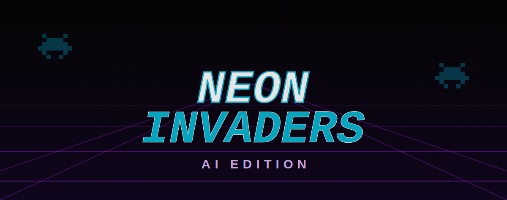

<div align="center">

</div>

> This is a small toy project, developed by the author vibecoding with AI Studio.

# Neon Invaders: AI Edition

[](https://ai.studio/apps/drive/1vCMNUg6BbhXntZn1VAftSxvkYgvo-NWk?fullscreenApplet=true)

**Neon Invaders** is a modern, web-based reimagining of the classic space shooter genre, built with **React** and powered by **Google's Gemini API**.

This project fuses nostalgic arcade gameplay with cutting-edge generative AI to create a dynamic experience where the alien overlords don't just attack you—they taunt you in real-time based on your performance.

## Description

Neon Invaders brings the 80s arcade experience to the modern web browser. It features a distinct "neon" visual style complete with CRT scanline effects, particle explosions, and retro sound effects.

The core twist of this edition is the **AI Integration**. Unlike traditional games with pre-scripted dialogue, the alien flagship communicates with you directly using the **Gemini 2.5 Flash** model. Whether you miss a shot, lose a life, or defeat a boss, the game generates unique, context-aware commentary that ranges from arrogant mockery to grudging respect.

## Features

*   **Classic Arcade Gameplay:** Fast-paced action involving dodging alien projectiles, shooting down fleets, and battling massive bosses.
*   **AI-Powered Commentary:** Uses the Google GenAI SDK to generate situational taunts (e.g., "Your shields are paper-thin, human" when hit, or "Impossible..." when a boss falls).
*   **Retro Aesthetic:** Styled with Tailwind CSS to mimic glowing vector graphics, complete with a CRT monitor overlay effect.
*   **Progressive Difficulty:** Enemies get faster and more aggressive as you advance.
*   **Boss Battles:** Face off against massive "Boss" entities with increased health and firepower.
*   **Resilient Architecture:** Includes circuit-breaker logic to handle API rate limits gracefully, falling back to pre-written lines if the AI is busy.

## Installation

To run this project locally, you need **Node.js** installed on your machine.

1.  **Clone the repository:**
    ```bash
    git clone https://github.com/pfelipm/neon-invaders.git
    cd neon-invaders
    ```

2.  **Install dependencies:**
    ```bash
    npm install
    ```

3.  **Configure the Environment:**
    Create a file named `.env.local` in the root directory and add your Gemini API key:
    ```env
    GEMINI_API_KEY=your_api_key_here
    ```
    > **Note:** You can get a free API key from [Google AI Studio](https://aistudio.google.com/).

4.  **Run the application:**
    ```bash
    npm run dev
    ```

5.  **Play:**
    Open your browser and navigate to `http://localhost:5173` (or the port shown in your terminal).

## Controls

*   **Movement:** `Arrow Keys` or `WASD`
*   **Shoot:** `Spacebar`
*   **Pause:** `P` or `ESC`

## Technical Details

This project serves as a demonstration of integrating Large Language Models (LLMs) into real-time interactive applications.

*   **Frontend Framework:** [React 19](https://react.dev/) with [TypeScript](https://www.typescriptlang.org/).
*   **Build Tool:** [Vite](https://vitejs.dev/) for lightning-fast HMR and bundling.
*   **AI Model:** [Google Gemini 2.5 Flash](https://deepmind.google/technologies/gemini/), chosen for its low latency and high throughput, essential for game loops.
*   **State Management:** React Hooks (`useState`, `useEffect`, `useCallback`) manage the game loop and render cycles.
*   **Styling:** [Tailwind CSS](https://tailwindcss.com/) for utility-first styling and complex glow effects.

### AI Implementation Strategy
The game uses a "fire-and-forget" strategy for AI calls to prevent blocking the game loop. It implements a **rate-limiting mechanism** (throttling requests to avoid quota exhaustion) and a **fallback system** (using local strings) if the API is unreachable or rate-limited.

## Credits and Contributions

This project was created and is maintained by [Pablo Felip](https://github.com/pfelipm).

## License

This project is distributed under the MIT License. See the [LICENSE](LICENSE) file for more details.
